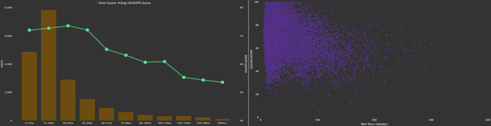

  
  &nbsp;&nbsp;&nbsp;&nbsp;
  <h1 align="center">Lakewood Regional Hospital Report (2017 - 2024)</h1>

 

<h2 align="center">Project Background</h2>

Lakewood Regional Hospital is a full-service regional medical center providing inpatient, outpatient, and emergency care across multiple departments including ICU, Oncology, Pulmonology, Maternity, and General Ward.

In this project, I partner with hospital leadership to analyze operational and financial data, extract insights, and deliver actionable recommendations to improve performance across clinical, billing, and patient experience teams.

<h4>North Star Metrics</h4>
<ul>
  <li><strong>Patient Admissions & Readmissions:</strong> tracking admission volume, readmission rates.</li>
  <li><strong>Cost & Revenue Analysis:</strong> measuring treatment costs and revenue recovery.</li>
  <li><strong>Insurance Claims Performance:</strong> evaluating claim approval rates and denial patterns to identify billing process gaps by payer.</li>
  <li><strong>Patient Experience & Length of Stay:</strong> assessing HCAHPS scores and length of stay trends to connect care quality with readmission risk.</li>
</ul>
 

<h2 align="center">Executive Summary</h2>

Lakewood Regional Hospital's 10.6% readmission rate exceeds the 7–8% industry benchmark, with chronic condition patients driving 90% of all readmissions and the 50–65 age cohort emerging as the most underserved group in post-discharge care. Financially, a $19.5M revenue gap and a 43.6% insurance claim approval rate — with Humana lagging all payers at 39% and denials spread across seven categories — point to systemic billing and collections failures rather than isolated issues. Operationally, ICU and Pulmonology are dual outliers, posting the highest costs ($10,269 and 9.2-day stays), lowest satisfaction scores, and elevated readmission rates, making them the hospital's single greatest opportunity for targeted intervention.

 
 

  

 

<h2 align="center">Insights: Admissions vs Readmissions</h2>

  

 
<ul>
  <li>13,429 total admissions recorded, with a 10.6% overall readmission rate (1,429 readmissions) — above the typical 7–8% industry benchmark.</li>
  <li>Pulmonology (12.6%) and ICU (12.3%) are the highest readmission risk departments, consistently outpacing the hospital average across all periods.</li>
  <li>Patients aged 50–65 carry the highest readmission rate at 11.6%, slightly exceeding even the 65+ group, suggesting this cohort may be underserved in post-discharge follow-up programs.</li>
  <li>Chronic condition patients drive 90% of all readmissions (1,282 of 1,429), representing the single largest opportunity to reduce readmission volume through targeted care transition programs.</li>
</ul>
 
<h2 align="center">Cost & Revenue</h2>

  

 

<table>
  <tr>
    <td>

- Total treatment costs hit $69M across 13,429 admissions ($5,136 avg), driven by procedures (32.5%), medications (27.4%), and labs (19.9%).
- A $19.5M revenue gap exists — $7.7M written off and $15.8M still pending — signaling significant billing and collections risk.
- ICU costs $10,269 per stay — nearly 2x Oncology and 3.5x General Ward — making it the single largest cost containment opportunity.

    </td>
    <td>
      
    </td>
  </tr>
</table>
 
<h2 align="center">Insurance Claims & Performance</h2>

  

 
<ul>
  <li>Of 11,599 claims totaling $59.7M, only 43.6% was approved ($26M) — with 2,038 claims denied ($10.7M) and 3,332 still pending ($17.7M), leaving over half of claimed value unresolved.</li>
  <li>Denial reasons are evenly distributed across 7 categories — out-of-network providers, uncovered services, benefit limits, and missing pre-authorizations each accounting for ~300 denials — suggesting systemic process gaps rather than a single fixable issue.</li>
  <li>Humana has the lowest approval rate at 39%, notably underperforming vs. Medicare/Medicaid (~44%), indicating a need for payer-specific claim reviews with Humana contracts.</li>
  <li>All insurers average ~23 days processing time with minimal variation, suggesting delays are driven by internal claim preparation quality rather than payer-side bottlenecks.</li>
</ul>
 
<h2 align="center">Patient Satisfaction Score & Length Of Stay</h2>

  

 
<ul>
  <li>Overall average score is 71.0, with satisfaction dropping sharply by department — Pulmonology scores lowest at 67.6 while Maternity leads at 73.1, a 5.5-point gap suggesting significant variation in care experience across units.</li>
  <li>Average LOS is 6.4 days, with ICU and Pulmonology as clear outliers at 11.2 and 9.2 days — nearly double the hospital average.</li>
  <li>LOS spiked sharply during COVID-19 in 2020 (9.4 days), nearly double pre-pandemic levels (5.1–5.3), before gradually recovering to 5.2 days by 2022–2024 — now trending at pre-pandemic norms.</li>
  <li>Readmitted patients average 0.5 days longer per stay (6.8 vs. 6.4), suggesting incomplete recovery is driving both longer stays and return admissions.</li>
</ul>
 
<h2 align="center">Recommendations</h2>

<h3 align="left">Admission:</h3>
<h4>Lakewood Regional Hospital should implement a targeted post-discharge follow-up program for Pulmonology and ICU patients aged 50–65 with chronic conditions — the three highest readmission risk factors. A structured 7-day and 30-day check-in protocol for this cohort could bring the hospital's readmission rate in line with the 7–8% industry benchmark. </h4>

<h3 align="left">Cost & Revenue:</h3>
<h4>Launch a revenue recovery initiative targeting the $15.8M in pending payments while reducing avoidable ICU stays through earlier step-down protocols.</h4>

<h3 align="left">Insurance Claims:</h3>
<h4>Focus on a pre-submission claims audit targeting the top denial reasons — particularly pre-authorization gaps and incomplete documentation — which together account for nearly 600 denials and an estimated $3M+ in recoverable revenue.</h4>

<h3 align="left">Customer Satisfaction Score:</h3>
<h4>Lakewood Regional should use Maternity and Outpatient as internal benchmarks — auditing their care delivery practices and applying lessons to ER and Pulmonology to meaningfully close the hospital's 5.5-point satisfaction gap.</h4>

<h3 align="left">Length of stay:</h3>
<h4>Set ward-level LOS benchmarks with discharge planning triggers at day 7 for ICU and Pulmonology — the two units with the most room to reduce extended stays and free up capacity.</h4>
 

<h2>Tools & Stacks used:</h2>

  
  
  
  

