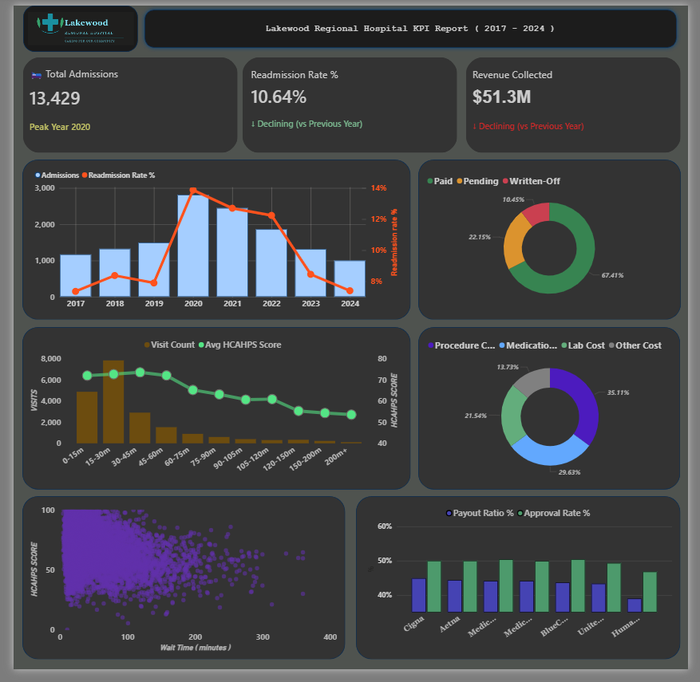
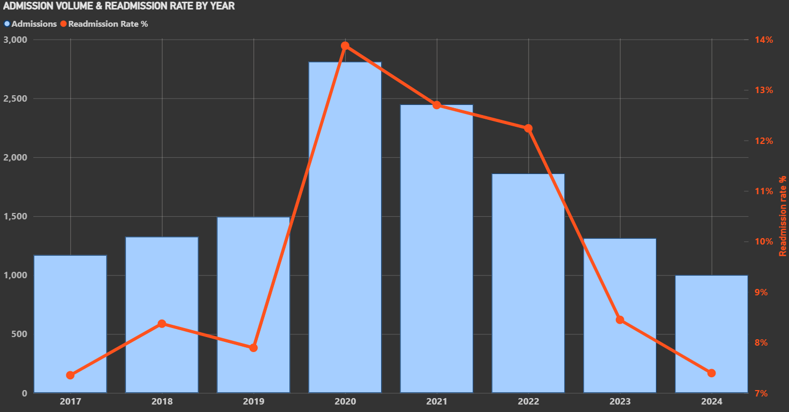

  
  &nbsp;&nbsp;&nbsp;&nbsp;
  <h1 align="center">Lakewood Regional Hospital Report (2017 - 2024)</h1>

 

<h2 align="center">Project Background</h2>

Lakewood Regional Hospital is a full-service regional medical center providing inpatient, outpatient, and emergency care across multiple departments including ICU, Oncology, Pulmonology, Maternity, and General Ward.

In this project, I partner with hospital leadership to analyze operational and financial data, extract insights, and deliver actionable recommendations to improve performance across clinical, billing, and patient experience teams.

<h4>North Star Metrics</h4>
<ul>
  <li><strong>Patient Admissions & Readmissions:</strong> tracking admission volume, readmission rates.</li>
  <li><strong>Cost & Revenue Analysis:</strong> measuring treatment costs and revenue recovery.</li>
  <li><strong>Insurance Claims Performance:</strong> evaluating claim approval rates and denial patterns to identify billing process gaps by payer.</li>
  <li><strong>Patient Experience & Length of Stay:</strong> assessing HCAHPS scores and length of stay trends to connect care quality with readmission risk.</li>
</ul>
 

<h2 align="center">Executive Summary</h2>

Lakewood Regional Hospital's 10.6% readmission rate exceeds the 7–8% industry benchmark, with chronic condition patients driving 90% of all readmissions and the 50–65 age cohort emerging as the most underserved group in post-discharge care. Financially, a $19.5M revenue gap and a 43.6% insurance claim approval rate — with Humana lagging all payers at 39% and denials spread across seven categories — point to systemic billing and collections failures rather than isolated issues. Operationally, ICU and Pulmonology are dual outliers, posting the highest costs ($10,269 and 9.2-day stays), lowest satisfaction scores, and elevated readmission rates, making them the hospital's single greatest opportunity for targeted intervention.

 
 

  

 

<h2 align="center">Insights: Admissions vs Readmissions</h2>

  

 
<ul>
  <li>13,429 total admissions recorded, with a 10.6% overall readmission rate (1,429 readmissions) — above the typical 7–8% industry benchmark.</li>
  <li>Pulmonology (12.6%) and ICU (12.3%) are the highest readmission risk departments, consistently outpacing the hospital average across all periods.</li>
  <li>Patients aged 50–65 carry the highest readmission rate at 11.6%, slightly exceeding even the 65+ group, suggesting this cohort may be underserved in post-discharge follow-up programs.</li>
  <li>Chronic condition patients drive 90% of all readmissions (1,282 of 1,429), representing the single largest opportunity to reduce readmission volume through targeted care transition programs.</li>
</ul>
 
